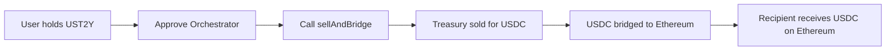
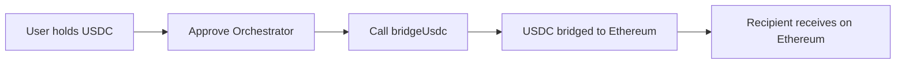

# Tokenized Treasury Notes on Arbitrum

## Overview

This feature extends the LayerZero v2 + Stargate v2 bridge with tokenized US Treasury notes on Arbitrum. Users can:
1. Hold tokenized treasury notes representing fractional ownership of US Treasury securities
2. Sell treasury tokens for USDC through an automated marketplace
3. Bridge the USDC proceeds to Ethereum in a single transaction

## Architecture

### Core Components

#### TokenizedTreasury (UST2Y)
An ERC20 token representing tokenized US Treasury notes with:
- **Compliance features**: Blacklisting, pausing, authorized minters
- **Treasury metadata**: Maturity date, coupon rate, CUSIP identifier
- **Value tracking**: Total value locked and per-token valuation
- **Interest calculation**: Simplified accrued interest computation

#### TreasuryMarketplace
An automated market maker (AMM) for trading treasury tokens:
- **Constant product formula**: Automated pricing based on reserves
- **Fee structure**: Configurable trading fees (default 0.3%)
- **Liquidity management**: Owner can add/remove liquidity
- **Trading limits**: Daily volume caps and per-transaction limits
- **Price discovery**: Dynamic pricing with spread protection

#### TreasuryBridgeOrchestrator
Combines selling and bridging in one transaction:
- **Sell and bridge**: Convert treasury tokens to USDC and bridge to Ethereum
- **Partial bridging**: Option to bridge only part of the proceeds
- **Direct bridging**: Bridge existing USDC without selling
- **Statistics tracking**: User and global transaction metrics
- **Gas optimization**: Batched operations to minimize transactions

## User Flows

### Flow 1: Sell Treasury and Bridge to Ethereum



1. User holds UST2Y tokens on Arbitrum
2. Approves orchestrator to spend UST2Y
3. Calls `sellAndBridge()` with:
   - Treasury amount to sell
   - Minimum USDC expected
   - Ethereum recipient address
   - Bridge fee in ETH
4. Orchestrator executes:
   - Sells treasury for USDC via marketplace
   - Bridges USDC to Ethereum via Stargate
   - Returns transaction GUID

### Flow 2: Direct USDC Bridge



## Deployment

### Prerequisites
- Deploy on Arbitrum (mainnet or Sepolia testnet)
- Have existing UsdcBridgeSender deployed
- USDC token address configured

### Deploy Treasury Contracts

```bash
# Set environment variables
export BRIDGE_SENDER_ADDRESS=<existing_bridge_sender>

# Deploy on Arbitrum Sepolia
forge script script/DeployTreasury.s.sol --rpc-url $ARBITRUM_RPC_URL --broadcast

# Deploy on Arbitrum One (mainnet)
forge script script/DeployTreasury.s.sol --rpc-url arbitrum --broadcast --verify
```

### Setup Initial Liquidity

```bash
# Configure liquidity parameters
export TREASURY_ADDRESS=<deployed_treasury>
export MARKETPLACE_ADDRESS=<deployed_marketplace>
export USDC_ADDRESS=<usdc_on_arbitrum>
export TREASURY_LIQUIDITY_AMOUNT=1000000000000000000000000  # 1M tokens
export USDC_LIQUIDITY_AMOUNT=1000000000000  # 1M USDC

# Add liquidity
forge script script/DeployTreasury.s.sol:SetupTreasuryLiquidity --rpc-url $ARBITRUM_RPC_URL --broadcast
```

## Configuration

### Treasury Token Parameters
```solidity
maturityDate: Unix timestamp of treasury maturity
couponRate: Annual rate in basis points (e.g., 450 = 4.5%)
cusip: CUSIP identifier for the underlying treasury
```

### Marketplace Parameters
```solidity
basePrice: Initial price in USDC per treasury token
spreadBps: Trading spread in basis points (default 50 = 0.5%)
feeBps: Trading fee in basis points (default 30 = 0.3%)
maxTransactionSize: Maximum trade size
dailyVolumeLimit: 24-hour trading volume cap
```

## Testing

Run the treasury test suite:

```bash
# Run all treasury tests
forge test --match-contract TokenizedTreasuryTest -vvv

# Test specific functionality
forge test --match-test testOrchestratorSellAndBridge -vvv
forge test --match-test testMarketplacePricing -vvv
```

## Security Considerations

### Access Controls
- **Minting**: Only authorized minters can create new treasury tokens
- **Blacklisting**: Compliance feature to block specific addresses
- **Pausing**: Emergency pause for all token transfers
- **Owner controls**: Marketplace liquidity and pricing management

### Trading Protections
- **Slippage protection**: Minimum output amounts on trades
- **Daily limits**: Caps on 24-hour trading volume
- **Transaction limits**: Maximum size per trade
- **Spread mechanism**: Built-in spread to prevent manipulation

### Bridge Security
- **Composer validation**: Ensures correct destination contracts
- **Fee verification**: Checks sufficient ETH for bridge fees
- **Refund mechanism**: Returns excess ETH and USDC to users

## Integration Examples

### Frontend Integration

```javascript
// Quote sell and bridge operation
const [expectedUsdc, bridgeFee] = await orchestrator.quoteSellAndBridge(
  treasuryAmount,
  true, // bridge all proceeds
  0
);

// Execute sell and bridge
const tx = await orchestrator.sellAndBridge(
  treasuryAmount,
  minUsdcOut,
  ethereumRecipient,
  true,
  0,
  { value: bridgeFee }
);
```

### Smart Contract Integration

```solidity
// Integrate with other protocols
interface IOrchestrator {
    function sellAndBridge(
        uint256 treasuryAmount,
        uint256 minUsdcOut,
        address ethereumRecipient,
        bool bridgeAllProceeds,
        uint256 bridgeAmount
    ) external payable returns (
        uint256 usdcReceived,
        uint256 usdcBridged,
        bytes32 bridgeGuid
    );
}
```

## Gas Optimization

The system is optimized for gas efficiency:
- **Batched operations**: Single transaction for sell + bridge
- **Minimal storage**: Uses immutable variables where possible
- **Efficient math**: Optimized constant product calculations
- **Via-IR compilation**: Enabled for stack optimization

## Future Enhancements

Potential improvements for production:
1. **Chainlink price feeds**: Replace simplified oracle with Chainlink
2. **Multi-asset support**: Support multiple treasury maturities
3. **Yield strategies**: Auto-compound interest into DeFi protocols
4. **Governance**: Decentralized control of marketplace parameters
5. **Cross-chain treasury**: Deploy on multiple L2s with bridging

## Troubleshooting

### Common Issues

**Issue**: "Insufficient liquidity" error
**Solution**: Add more USDC liquidity to the marketplace

**Issue**: "Daily limit exceeded"
**Solution**: Wait for limit reset or request limit increase from owner

**Issue**: "Bridge fee insufficient"
**Solution**: Include more ETH for LayerZero fees

## License

MIT